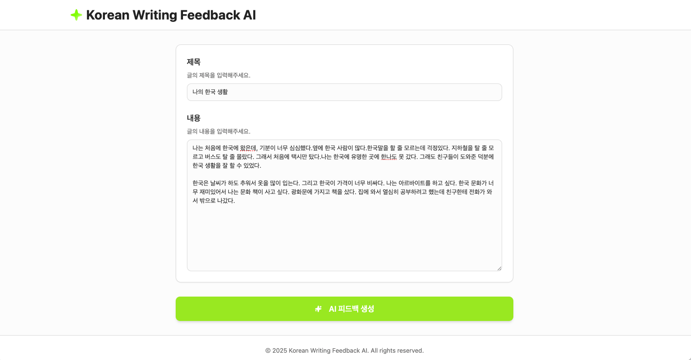
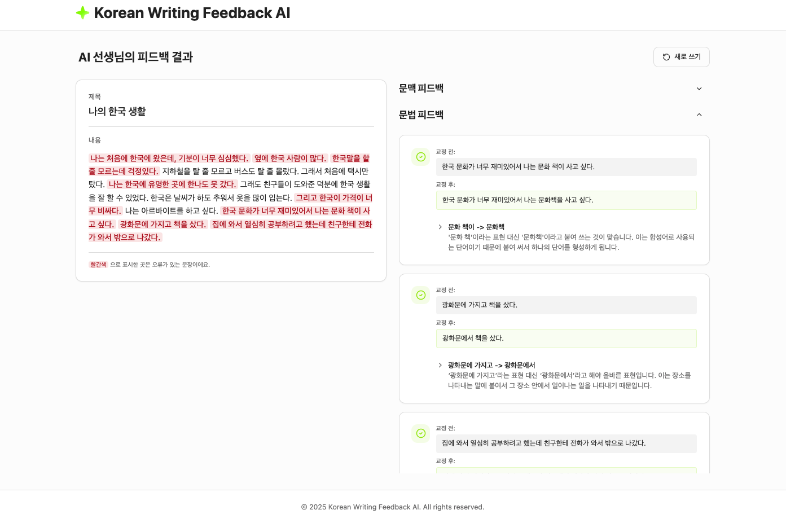

# Korean Writing Feedback Web

> 2025-2 컴퓨터공학과 졸업 프로젝트

<br>

[외국어로서의 한국어 학습자를 위한 RAG 기반 쓰기 피드백 시스템](https://github.com/mingdodev/korean-writing-feedback-rag)의 웹 프론트엔드입니다. 초기 UI 스켈레톤 및 컴포넌트 구조는 Lovable의 **Prompt-driven UI Generation**을 기반으로 작성되었습니다.

본 서비스는 **RAG(Retrieval-Augmented Generation)** 기반 백엔드 API를 통해 **글의 문맥에 대한 전반적인 피드백**과 **문장별 문법 오류 교정 & 피드백에 대한 설명**을 제공합니다.

## 주요 기능

본 서비스는 글쓰기 특성을 고려하여 **웹 플랫폼**에 최적화된 UI/UX로 구성되었습니다.

- **문맥 피드백**과 **문장별 피드백**을 명확히 구분한 UI 구조로 가독성 강화

- 오류 문장을 클릭하면 문법 피드백 섹션으로 **자동 스크롤 이동**


- **‘새로 쓰기’ 기능**

    - 작성했던 제목과 내용이 그대로 유지된 채 첫 화면으로 이동하여,  
  학습자가 AI 결과에 의존하지 않고 **스스로 글을 다시 수정·개선할 수 있도록 설계**

<br>

## 실행 방법

```bash
# 의존성 설치
npm install

# 개발 서버
npm run dev
# → http://localhost:5173

# 프로덕션 빌드
npm run build

# 빌드 결과 미리보기
npm run preview
```

<br>

## UI 미리보기



