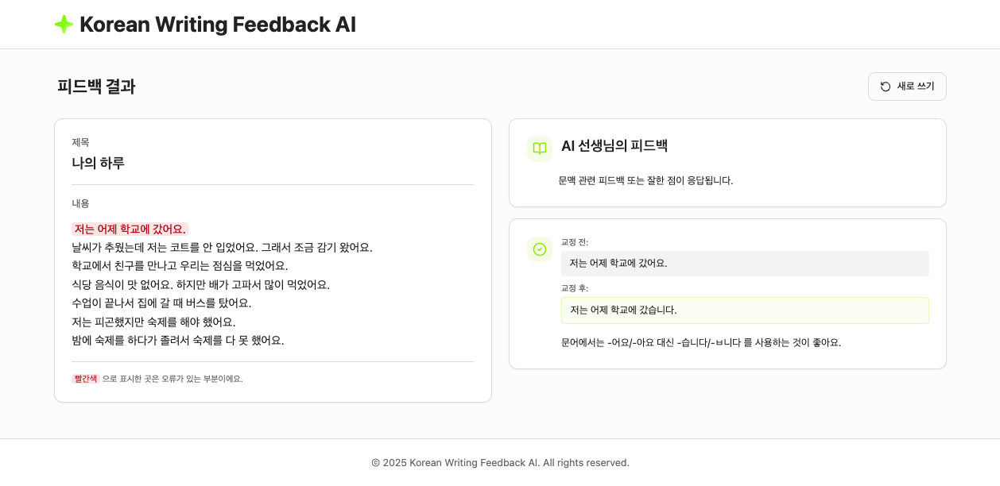

# Korean Writing Feedback Web

> 2025-2 컴퓨터공학과 졸업 프로젝트

<br>

외국인 학습자를 위한 한국어 쓰기 피드백 플랫폼의 웹 프론트엔드입니다.  
**RAG(Retrieval-Augmented Generation)** 기반 백엔드 API를 통해 **글의 문맥에 대한 전반적인 피드백**과 **문장별 문법 오류 교정 & 피드백에 대한 설명**을 제공합니다.

<br>

## 실행 방법

```bash
# 의존성 설치
npm install

# 개발 서버
npm run dev
# → http://localhost:5173

# 프로덕션 빌드
npm run build

# 빌드 결과 미리보기
npm run preview
```

<br>

## UI 미리보기

